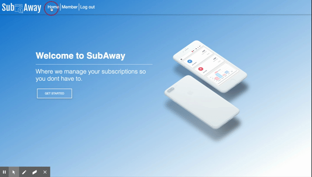

# SubAway

https://subaway.herokuapp.com/

## Description 

The quality of a README often differentiates a good project from a bad project. A good one takes advantage of the opportunity to explain and showcase what your application does, justify the technologies used, and even talk about some of the challenges you faced and features you hope to implement in the future. A good README helps you stand out among the large crowd of developers putting their work on GitHub.

There's no one right way to structure a good README. There is one very wrong way, however, and that is to not include a README at all or to create a very anemic one. This guide outlines a few best practices. As you progress in your career, you will develop your own ideas about what makes a good README.

At a minimum, your project README needs a title and a short description explaining the what, why, and how. What was your motivation? Why did you build this project? (Note: The answer is not "Because it was a homework assignment.") What problem does it solve? What did you learn? What makes your project stand out? If your project has a lot of features, consider adding a heading called "Features" and listing them here.

If you're new to Markdown, read the GitHub guide on [Mastering Markdown](https://guides.github.com/features/mastering-markdown/).

If you need an example of a good README, check out [the VSCode repository](https://github.com/microsoft/vscode).

## Table of Contents

* [Installation](#installation)
* [Usage](#usage)
* [Credits](#credits)
* [License](#license)

## Installation

To install use the following command: 
<pre><code>npm i</pre></code>

## Usage 

Run: <pre><code>npm start</pre></code> 

## Technologies Used

* MERN stack
* Auth0
* Axios
* React Datepicker
* Moment.js
* HTML
* CSS (MDBootstrap & Bootstrap)

## Credits

Christian Marquez - https://github.com/tiroxxx  

Sarah Iraurgui - https://github.com/irasar

## License

## Badges

## Contributing

Contributions in the form of issues and pull requests are welcomed and encouraged.

